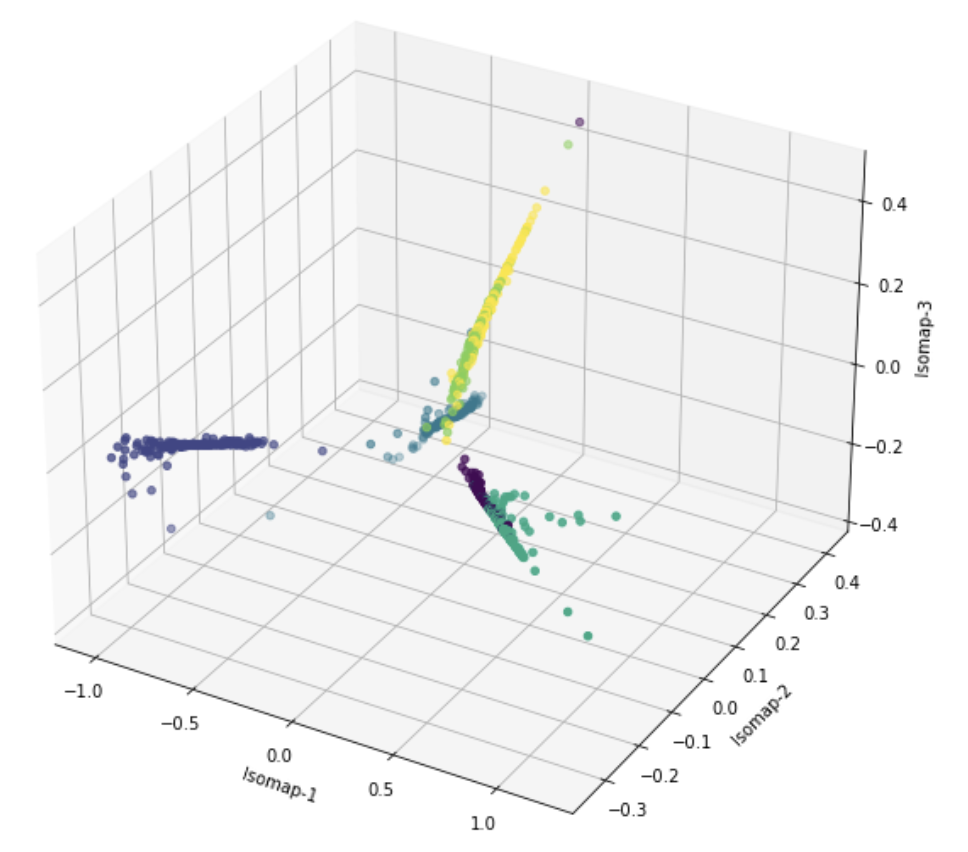

# Summary

Pokemoinoes is a toy model for creation of 3D Volumes containing geometrical 
objects (polyominoes) for applications in computer vision. 

# Statement of need

Statement of need will live here. 
I am now testing creation of a PDF based on this paper.md file. 

# Mathematics

Single dollars ($) are required for inline mathematics e.g. $f(x) = e^{\pi/x}$

Double dollars make self-standing equations:

$$\Theta(x) = \left\{\begin{array}{l}
0\textrm{ if } x < 0\cr
1\textrm{ else}
\end{array}\right.$$

You can also use plain \LaTeX for equations
\begin{equation}\label{eq:fourier}
\hat f(\omega) = \int_{-\infty}^{\infty} f(x) e^{i\omega x} dx
\end{equation}
and refer to \autoref{eq:fourier} from text.

# Citations

Citations to entries in paper.bib should be in
[rMarkdown](http://rmarkdown.rstudio.com/authoring_bibliographies_and_citations.html)
format.

If you want to cite a software repository URL (e.g. something on GitHub without a preferred
citation) then you can do it with the example BibTeX entry below for @fidgit.

For a quick reference, the following citation commands can be used:
- `@author:2001`  ->  "Author et al. (2001)"
- `[@author:2001]` -> "(Author et al., 2001)"
- `[@author1:2001; @author2:2001]` -> "(Author1 et al., 2001; Author2 et al., 2002)"

# Figures

Figures can be included like this:
{ width=20% }
and referenced from text using \autoref{fig:example}.

Figure sizes can be customized by adding an optional second parameter:

![Caption for example figure.]
(figures/isomap3d.png){ width=20% }

# Acknowledgements

We acknowledge contributions from...

# References
